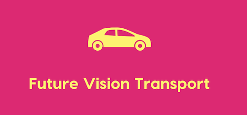
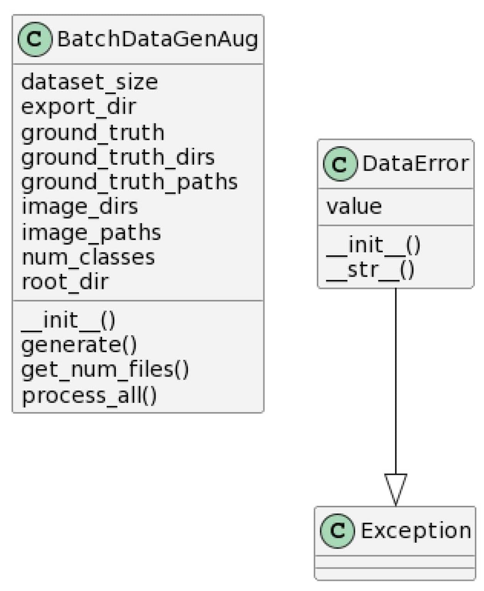
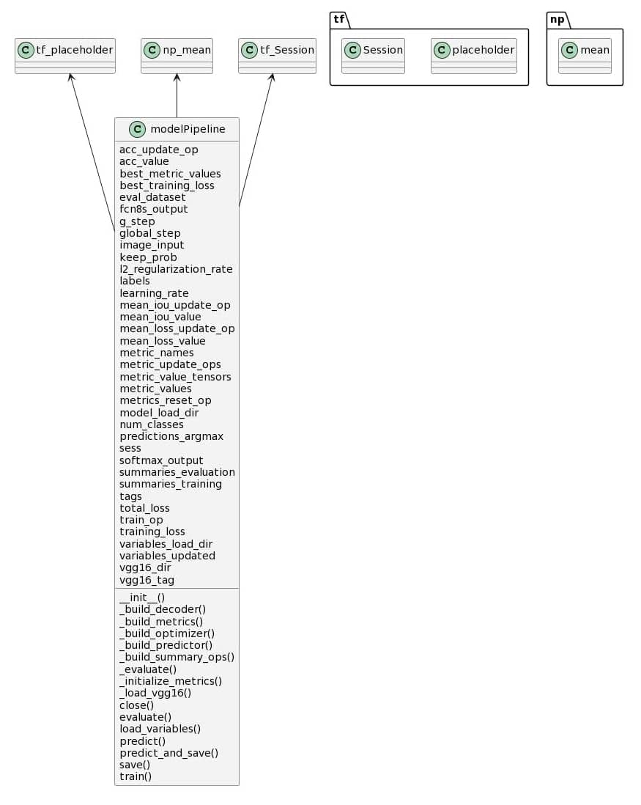

# Future Vision Transport

**Future Vision Transport** est une entreprise qui conçoit des systèmes embarqués de vision par ordinateur pour les véhicules autonomes.

L’objectif de ce projet est de concevoir un modèle de segmentation d’images répondant aux besoins des équipes de traitement des images et de système de décision.

## Note technique

Pour plus d’information, la note technique est lisible en [cliquant ici](https://nbviewer.jupyter.org/github/Abdess/Future-Vision-Transport/blob/main/Note_technique.pdf).

## Sous projets

Ce projet est constitué de 3 sous projets.

### Pipeline

[Code source](https://github.com/Abdess/cityscapesScripts)

[Documentation](https://nbviewer.jupyter.org/github/Abdess/Future-Vision-Transport/blob/main/data/doc/batchdatagenaug.html)

Le projet cityscapesScripts [cityscapesScripts](https://github.com/mcordts/cityscapesScripts) a été forké pour y ajouter la [segmentation par catégories](https://github.com/Abdess/cityscapesScripts/blob/master/cityscapesscripts/helpers/labels_bdga.py), [l’augmentation des données et un générateur de données](https://github.com/Abdess/cityscapesScripts/blob/master/cityscapesscripts/preparation/batchdatagenaug.py).

### Modélisation

[Code source](data/scripts)

[Documentation](https://nbviewer.jupyter.org/github/Abdess/Future-Vision-Transport/blob/main/data/doc/cityscapes_tensorflow.html)

Scripts permettant d’entrainer différents modèles (FCN, U-Net et Segnet) avec un système de tuning et de sauvegarde automatique.

### API Flask

[Site web](https://future-vision-transport.herokuapp.com/)

[Code source](https://github.com/Abdess/Future-Vision-Transport-API)

API Flask qui prend une image en entrée pour fournir une segmentation d’image en sortie.
